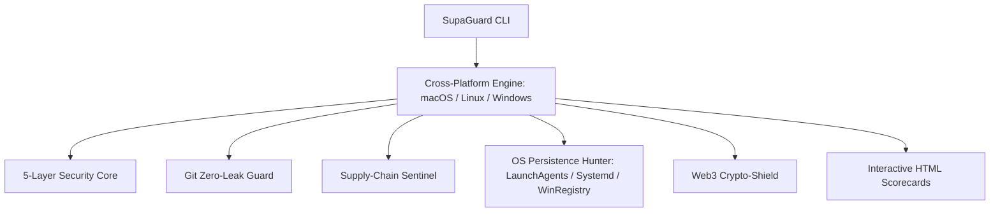

<p align="center">
  <h1 align="center">SUPAGUARD</h1>
  <p align="center">
    <strong>100% Security & Multi-Layer Developer Defense Suite</strong><br>
    Universal Cross-Platform Antivirus, Real-Time Shield, Supply-Chain Sentinel & Git Zero-Leak Blocker.
  </p>
  <p align="center">
    <a href="https://npmjs.com/package/@dev_apus/supaguard"></a>
    <a href="https://pypi.org/project/supaguard-cli"></a>
    <a href="LICENSE"></a>
    <a href="https://github.com/supaguard/supaguard/actions"></a>
  </p>
</p>

---

## Overview

**SupaGuard** is a developer-first, cross-platform multi-engine security suite built to safeguard local codebases, microservices, and smart contract repositories across **macOS**, **Linux**, and **Windows**.



---

## Installation & Distribution

### 1. Instant Run via NPX (Zero-Install)
Works out of the box on macOS, Linux, and Windows:
```bash
# Run immediate scan on current project
npx @dev_apus/supaguard scan .

# Generate interactive dark-mode HTML security report
npx @dev_apus/supaguard scan . --html
```

### 2. Global Install via NPM
```bash
npm install -g @dev_apus/supaguard
supaguard doctor
```

### 3. macOS & Linux One-Liner (Bash / Zsh)
```bash
# Using curl:
curl -fsSL https://raw.githubusercontent.com/supaguard/supaguard/main/install.sh | bash

# Using wget:
wget -qO- https://raw.githubusercontent.com/supaguard/supaguard/main/install.sh | bash
```

### 4. Windows One-Liner (PowerShell)
Run in PowerShell:
```powershell
iwr -useb https://raw.githubusercontent.com/supaguard/supaguard/main/install.ps1 | iex
```

### 5. Python Package via Pip
```bash
pip install supaguard-cli
# or
pipx install supaguard-cli
```

---

## Core Capabilities

### 1. Sub-15ms Git Zero-Leak Pre-Commit Hooks
Prevent leaked credentials, Stripe live keys, AWS secrets, Google service accounts, or backdoors from ever touching Git history or GitHub remotes across macOS, Linux, and Windows.
```bash
# Protect current repository
supaguard hook install .

# Protect all Git repositories across your entire workspace
supaguard hook install --all
```

### 2. Supply-Chain & Safe-Install Sentinel
Inspects packages before executing `npm install`, `yarn add`, `bun add`, or `pnpm add`.
* **Typosquatting Detection:** Flags packages mimicking popular libraries (e.g. `crossenv` vs `cross-env`).
* **Freshness & Age Checks:** Flags newly published packages (<48 hours old).
* **Lifecycle Script Sandboxing:** Unpacks and decodes obfuscated `preinstall`/`postinstall` scripts before execution.
```bash
# Inspect and install safely
supaguard safe-install express react lodash

# Standalone registry inspection
supaguard check-package crossenv
```

### 3. Web3 & Smart Contract Crypto-Shield
* Detects stealth `eth_signTypedData_v4` permit drainer patterns and unlimited ERC-20 token approval traps (`approve(MaxUint256)`).
* Scans files and shell history (`.zsh_history`, PowerShell history) for unencrypted 12/24-word BIP-39 mnemonic seed phrases.
* Audits Solidity contracts for hidden ownership backdoors and unsafe assembly `delegatecall` opcodes.
```bash
supaguard scan ./web3 --web3
```

### 4. Semantic Explainer & Deobfuscator
Unpacks character code arrays, base64 strings, and hex escapes, providing a plain-English explanation of payload intent.
```bash
supaguard explain suspicious-script.js
```

### 5. OS Persistence & Stealth Hunter
* **macOS:** Scans `/Library/LaunchDaemons`, `~/Library/LaunchAgents`, and shell startup profiles.
* **Linux:** Scans `/etc/ld.so.preload`, user/system `systemd` units, and `/etc/cron.*`.
* **Windows:** Scans Registry Run keys (`HKCU\...\Run`), Startup folder, and PowerShell profiles.
```bash
supaguard audit-system
```

### 6. Real-Time Active Shield (Background Daemon)
Monitors files in real time and intercepts write/execution events instantly.
```bash
# Start background shield (macOS, Linux, or Windows)
supaguard watch /path/to/project --daemon

# Check shield status
supaguard watch --status

# Stop shield
supaguard watch --stop
```

### 7. Interactive Dark-Mode HTML Scorecards
Generates a standalone, shareable HTML security report with posture grades (A+ to F), radar risk charts, and 1-click remediation details.
```bash
supaguard scan . --html
```

---

## Antigravity AI Integration

SupaGuard includes native support for **Google Antigravity** AI development workflows.

* **Antigravity Skill:** `.agents/skills/supaguard/SKILL.md` (Enables AI agents to autonomously audit security posture, protect commits, and sandbox third-party packages).
* **Antigravity Rule:** `.agents/rules/supaguard-security.md` (Enforces zero credential leakage during agent pair programming).

---

## Command Reference Matrix

| Command | Arguments / Flags | Description |
|---|---|---|
| `supaguard scan` | `[path] [--quick] [--html] [--web3] [--quarantine]` | Run multi-layer scan on files or directories |
| `supaguard sweep` | `[root_path] [--quick] [--html] [--web3]` | Discover and audit all Git repositories under a path |
| `supaguard watch` | `[path] [--daemon] [--status] [--stop]` | Launch real-time background file-system shield |
| `supaguard hook install` | `[path] [--all]` | Install sub-15ms pre-commit zero-leak hook |
| `supaguard hook uninstall`| `[path] [--all]` | Remove SupaGuard Git hooks |
| `supaguard safe-install` | `<pkg...> [--manager npm\|yarn\|bun\|pnpm]` | Audit dependencies for supply-chain risks before install |
| `supaguard check-package`| `<pkg>` | Inspect npm registry metadata & typosquats |
| `supaguard audit-system` | *(none)* | Audit macOS LaunchAgents, Linux systemd/cron, or Windows Registry |
| `supaguard explain` | `<file>` | Deobfuscate and semantically explain a payload |
| `supaguard doctor` | *(none)* | Verify installation of underlying engines (ClamAV, Trivy, Semgrep) |
| `supaguard quarantine` | `[list\|purge]` | Manage quarantined threat files |

---

## License

SupaGuard is licensed under the [MIT License](LICENSE).
